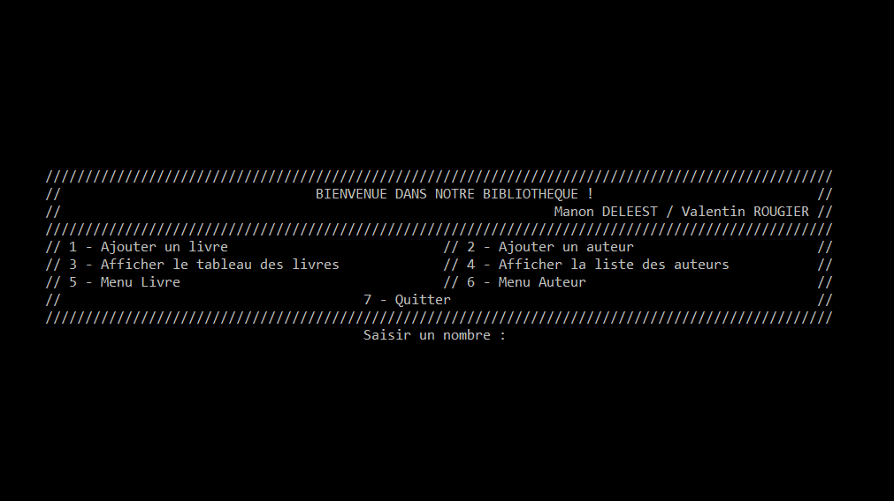

# Bibliotheque
Projet réalisé au cours du premier semestre de DUT Informatique. Ce projet a été élaboré sur plusieurs mois (Octobre 2019 - Janvier 2020) en collaboration avec [Manon Deleest](https://github.com/manon-deleest/manon-deleest).

## Présentation

Ce projet consitait a élaborer une bibliothèque numérique, un outil permettant de lister les oeuvres que nous avons. Le projet de la bibliothèque réalisé en C++ est réellement notre premier projet à l'IUT. Il intervient dans le module d'algorithmie. Il nous a permis de mettre en pratique certaines notions importantes apprises lors de ce module.

Pour résumer, l'application a diverses fonctionnalités : 
- Ajouter un livre/auteur
- Répertorier la liste des livres/auteurs
- Gérer les livres/auteurs

### Ajouter un livre/auteur
Cette fonctionnalité est très importante pour l'application. Elle permet de saisir nos livres, en enregistrant l'auteur qui l'a réalisé. Cela se réalise sous forme de formulaire que l'on remplit au fur et à mesure. L'utilisateur doit saisir quelques informations incontournables comme le nom du livre, son genre littéraire, son auteur, sa date de publication... Si l'auteur n'est pas connu en base de données, le formulaire de création d'auteur s'ouvre et l'utilisateur doit doner le nom, prenom, date de naissance, date de mort (s'il y a) de l'auteur.

### Réperotier la liste des livres/auteurs

C'est sans doute la partie que l'on consultera le plus souvent, la liste des auteurs ou des livres. Elle permet d'afficher tout ce qu'on a enregsitré précédemment. 
On retrouve sous forme de champs clé/valeur les inforations saisies.

### Gérer les livres/auteurs
Dans cette section, l'utilisateur pourra gérer ses saisies, il pourra les modifier si par exemple un auteur décède ou si celui-ci s'ets tout simplement trompé.
De plus, il aura l'opportunité de rechercher ou trier un livre grâce à différents filtres. 

De même on peut rechercher un auteur par nom ou par nationalité par exemple. 

